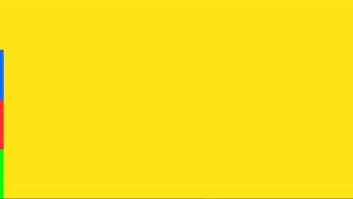

# ColorTabs
Minimalistic __*animated wallpaper*__ made for [Lively](https://rocksdanister.github.io/lively/ "Lively Wallpaper").

> To __USE__ the wallpaper download the __[Zip](https://github.com/BufuWinner/ColorTabs/releases/download/1.0/Tabs.zip "Tabs.zip")__ and drag it on the lively wallpaper window.  
> To __SWITCH__ between colors just click the tabs on the left.  
> To __CHANGE__ the tabs' colors go to the "*Personalize*" section in the Lively app.

## Easy as that!

